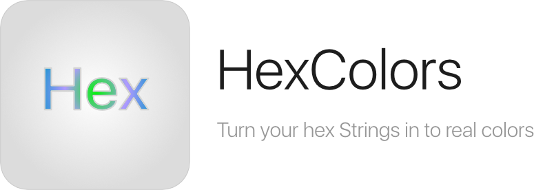

<p align="center">
    
</p>
=========================


[](https://codecov.io/gh/mRs-/HexColors)

HexColors is an extension for UIColor and NSColor to support for creating colors from a hex string like #FF0088 or 8844FF. Completely rewritten in Swift 3!

If you want to use this in Objective-C jump to the 3.X version Tag.

#RELEASE 5.0.0
Completely new and fresh in Swift 3. 

#Example iOS
``` swift
let colorWithHex = UIColor(hex: "#ff8942")
let colorWithoutHex = UIColor(hex: "ff8942")
let colorWithHexAndAlhpa = UIColor(hex: "#ff8942DF")
let colorWithoutHexAndAlhpa = UIColor(hex: "ff8942DF")
let shortColorWithHex = UIColor(hex: "#fff")
let shortColorWithoutHex = UIColor(hex: "fff")
let shortColorWithHexAndAlpha = UIColor(hex: "#FFFD")
let shortColorWithoutHexAndAlpha = UIColor(hex: "#FFFD")
```

#Example macOS
``` swift
let colorWithHex = NSColor(hex: "#ff8942")
let colorWithoutHex = NSColor(hex: "ff8942")
let colorWithHexAndAlhpa = NSColor(hex: "#ff8942DF")
let colorWithoutHexAndAlhpa = NSColor(hex: "ff8942DF")
let shortColorWithHex = NSColor(hex: "#fff")
let shortColorWithoutHex = NSColor(hex: "fff")
let shortColorWithHexAndAlpha = NSColor(hex: "#FFFD")
let shortColorWithoutHexAndAlpha = NSColor(hex: "#FFFD")
```

#Installation
* `pod install HexColors`
* or just drag the source files in your project

##Requirements
HexColors requires **>= iOS 8.0** and **>=macOS 10.9**.

##Credits
HexColors was created by [Marius Landwehr](https://github.com/mRs-) because of the pain recalculating Hex values to RGB.

##Creator
[Marius Landwehr](https://github.com/mRs-) [@mariusLAN](https://twitter.com/mariusLAN)

##License
HexColors is available under the MIT license. See the LICENSE file for more info.
